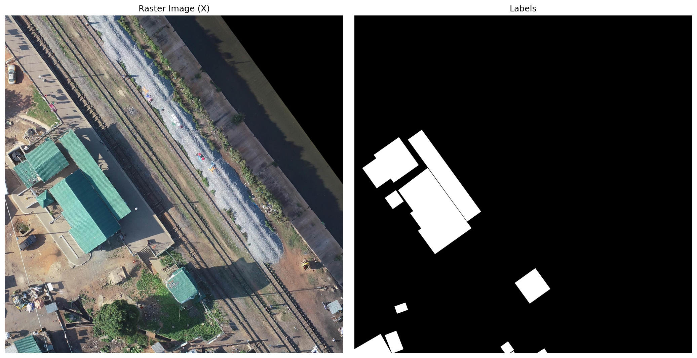
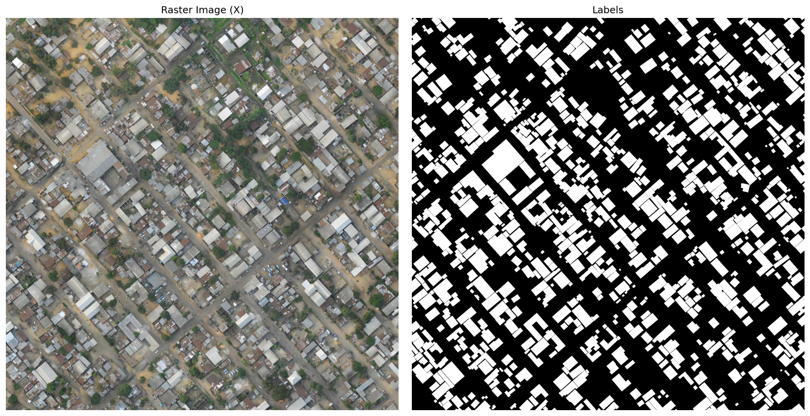

# Building Detection from Satellite Imagery

Semantic segmentation pipeline to detect buildings in aerial imagery of African cities, built on the [Open Cities AI Challenge](https://www.drivendata.org/competitions/60/building-segmentation-disaster-resilience/) dataset.

## Overview

The pipeline takes high-resolution aerial TIFs with paired GeoJSON building annotations and produces per-pixel building masks. It covers the full workflow from raw data to georeferenced predictions on unseen chips.

**Best validation IoU: 0.8198** (epoch 30, early stopping)

## Pipeline

```
data/raw/
  train_tier_1/   ← labelled chips (city/chip pairs)
  test/           ← unlabelled chips for inference

scripts/
  data_prep/      1. Rasterize GeoJSON labels → mask TIFs
                  2. Tile city rasters → 1024×1024 HDF5 patches
  training/       Train U-Net on patches, save best checkpoint
  inference/      Run model on full test chips, save prediction TIFs

data/predictions/ ← georeferenced binary masks (one per test chip)
```

## Model

- **Architecture:** U-Net with ResNet34 encoder (pretrained on ImageNet)
- **Loss:** BCE + Dice
- **Input:** 1024×1024 RGB patches, normalized to ImageNet statistics
- **Augmentation:** horizontal/vertical flips, 90° rotations, color jitter
- **Training split:** raster-level 80/20 split on tier 1 (prevents data leakage between patches from the same city raster)
- **Patch edges:** zero-padded to match the nodata borders present on test chips
- **Inference:** full 1024×1024 chips fed directly through the model (no tiling needed — model is fully convolutional)

## Training Curves

| Epoch | Train Loss | Train IoU | Val Loss | Val IoU |
|-------|-----------|-----------|----------|---------|
| 1     | 0.4788    | 0.7378    | 0.4262   | 0.7608  |
| 10    | 0.3715    | 0.7851    | 0.3620   | 0.7899  |
| 20    | 0.3307    | 0.8053    | 0.3310   | 0.8050  |
| 30    | 0.3017    | 0.8203    | 0.3029   | **0.8198** |
| 31    | 0.2996    | 0.8214    | 0.3034   | 0.8192  |

Training stopped at epoch 31 (run was interrupted; patience=10 not yet reached).

## Data Examples

The dataset covers a wide range of urban density and land use across African cities:

| Sparse / industrial | Dense urban |
|---|---|
|  |  |

## Predictions

Sample predictions on held-out test chips (red overlay = predicted building):


## How to Run

**1. Download data**
```bash
cd scripts/data_collection
bash 1_get_test_data.sh
bash 2_get_train_data.sh
```

**2. Decompress archives**
```bash
python 3_decompress.py
```

**3. Rasterize labels**
```bash
cd ../data_prep
python 1_rasterize_labels.py
```

**4. Tile training rasters into HDF5 patches**
```bash
python 2_tile.py
```

**5. Train**
```bash
cd ../training
python train.py
```
Checkpoint saved to `models/best.pth`. Metrics saved to `results/metrics.csv`.

**6. Run inference on test set**
```bash
cd ../inference
python inference.py
```
Outputs georeferenced GeoTIFFs to `data/predictions/`.

## Requirements

```bash
conda activate building-detection
```

Key dependencies: `pytorch`, `segmentation-models-pytorch`, `rasterio`, `fiona`, `albumentations`, `h5py`.
